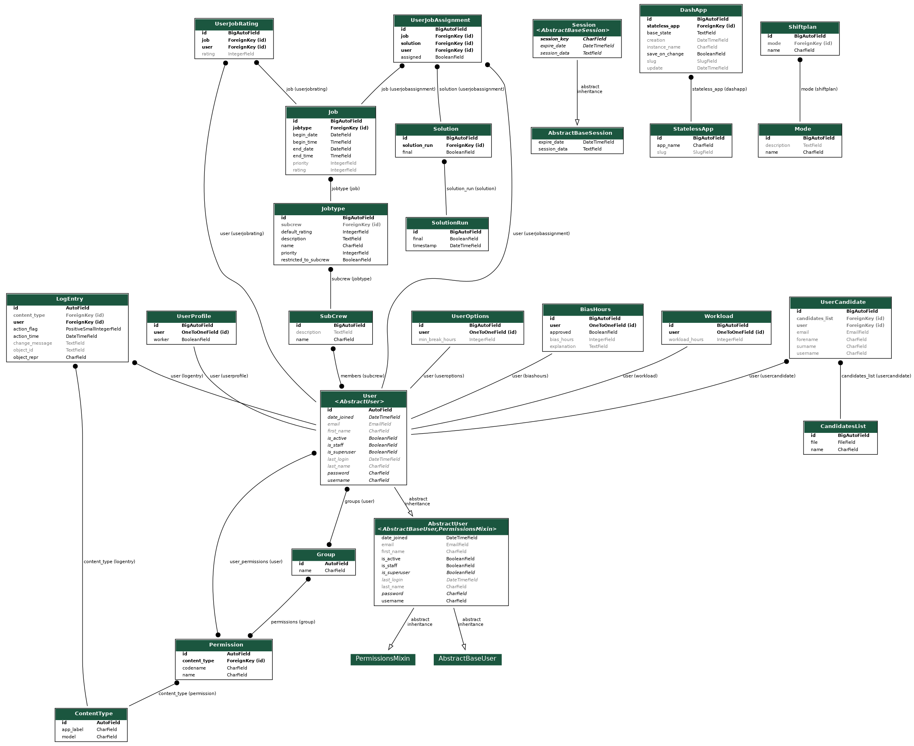

# shiftplan_of_harmony

## Structure 2023
The web interface is now based on django rather than pure html, php and javascript. 
I had trouble implementing a suitable, but not too complex structure to manage multiple shiftplans in one django project that different optimization algorithms can be applied to. The current version (TheShiftplan) manages a single shiftplan; for multiple shiftplan instances multiple server instances of that project is needed.
### TheShiftplan/
Django project: web interface for one single shiftplan. 

#### defs/
Django app to define and edit the structure, requirements and demands of the shift plan.

##### Shiftplan
There can only be one instance of Shiftplan. It holds the defined Mode which defines the optimization algorithm the data is applied to to get the result. 

##### Mode
Following optimization algorithms are implemented currently:
* **assign_every_job**: Each defined job must be assigned to a person. Each persons workload results from their bias_hours (working hours not covered by the shift plan) and the smallest possible difference to the average workload (whole_workload/num_workers). 
* **prioritized**: The solution does not necessarily fill every job, but takes into account their respective priorities and fills higher prioritized jobs preferentially.
* **non_prioritized**: The solution does not necessarily fill every job and also does not take into account any priorities of the jobs.

##### Job
* A job is a time interval a person performs a certain task.
* A job has a **start** and an **end** date and time and belongs to a **jobtype** which defines the details of the task.
* It also has a **priority** that defines the probability the job will be assigned in case the selected mode takes this into account. By default this attribute is inherited from the jobs jobtype.
* The **rating** attribute defines the default rating of the job if the user has not yet rated the job. By default this attribute is inherited from the jobs jobtype (default_rating).

##### Jobtype
* A jobtype has a **name** and a **description** of the task.
* It can be **restricted_to_subcrew** or not (bool).
* It can have a **subcrew** of persons this jobtype is restricted to.
* It also has a **priority** that defines the probability the jobs of this jobtype will be assigned in case the selected mode takes this into account.
* The **default_rating** attribute defines the default rating for jobs of this jobtype.

##### Subcrew
* A subcrew has a **name** and a **description**.
* It also has **members**, a many-to-many field to users; so a user can be part of multiple subcrews as well as a subcrew holds multiple users.

##### UserProfile
* One-to-one field **user**. UserProfile is created automatically for each user.
* Holds boolean attribute **worker** determining if the user is to be considered by the algorithm as a worker.

#### prefs/
Django app intended for the workers to specify their individual preferences concerning the shift plan.

##### UserJobRating
* Each job can be rated according to personal preferenes from 1 ("would love to do that job") to 5 ("I would never do that job.")
.3
* Foreign keys: **user**, **job**
* The attribute **rating** represents how much the user would like to do the job.

##### UserOptions
* One-to-one field **user**. UserOptions is created automatically for each user.
* **min_break_hours** represents the number of hours a worker has a break after a job.

##### BiasHours
* **bias_hours** are working hours that are performed by a **user** (one-to-one) beyond the jobs defined by instances of Job. 
* One-to-one field **user**. BiasHours is created automatically for each user with default 0.
* Boolean **approved**: True if Admin accepts requested bias hours or bias_hours equals 0.
* The user may give an explanaion text for the requested bias_hours.

##### Workload
This Model is only relevant if the workers have a predefined workload that is not determined by the average workload. (Not every job has to be assigned.)
* One-to-one field **user**. Workload is created automatically for each user.
* **workload_hours**: the workload of a user.

#### sols/
Django app intended for the presentation of the solution after the optimization run. 

##### SolutionRun
A SolutionRun has a set of solutions resulting by one specific optimization run.
* Boolean field **final**: Only one solution run can be set final.
* **timestamp** timestamp of solution run.

##### Solution
* Boolean field **final**: Only one solution with the same solution_run can be set final.
* Foreign key **solution_run**: which solution run this solution is part of.

##### UserJobAssignment
* Foreign keys: **user**, **job**
* Foreign key **solution**: which solution this instance is part of.
* Boolean field **assigned**: True if the user is assigned to the job within the solution.

---
## Old Structure (2022)
### deftab/
#### index.php
index.php uses def.js for definitions of day and job credentials.
**Day input fields** can be added by clicking the plus sign in the top left corner. Deletion by clicking the minus symbol next to the last day box. You can only delete the last day box.

**Job input fields** can be added by clicking the second plus sign. Deletion by clicking the minus symbol of the job box. You can delete each job box on its own.
**Helper checkbox** is made for jobs that don't follow the usual rules of shift assignment and build a seperate data set for an own model.
In def.js, the `name_special` variable can be changed to change the label for this checkbox. It can be used to mark all kinds of exceptions.
**Sensibel checkbox** makes the default preference value equals 5 for all jobs of that jobtype.

#### tab.php
tab.php uses deftabsketch.js to create a editable table to define time intervals of jobs.

#### delete_jobtype.php

### crew_prios/
Website to define preferences for each job that is not a helper job.
For a costum man text rename the file "indexmantxt.txt" to "_indexmantxt.txt" and edit its containing text.
### index.php

.
### TODO

* Barrierefreie Farben!
* Layout von allem.
* Mehr utf8s in die encoding Funktionen.

#### deftab
##### Appearence
* Calculate & show day of griditems.
* [DONE] Show how many griditems are currently selected.
* Red frame around each job after saving for a short time.
* Nicer css

##### Functionality
* The person who created a job(type) should be the only one who is able to delete/edit that job(type).
* [DONE] Delete jobtype and corresponding jobs. (button, functionality, security, integrety)
* [DONE] Link day entries of table Jobs to corresponding entry of table Days.
* [DONE] Numeric date format for day.
* [DONE[ German Umlauts!!!
* [DONE] Insert Jobtypes into DB only once even if tab.php is reloaded.
* [DONE] Create day view: edit one day at whole page.

* [DONE] Job db table with a column that refers to corresponding jobtype.
* [DONE] Insert new job only if its not predefined.
* [DONE] Show predefined jobs in deftabsketch.

* Create view to edit only new jobs.
* Competences --> Create file upload (*.txt)
* [DONE] Show competences text as info text on hover
* Button to view competences text as whole Document (optional)
* Download button for competences text.
* Number input in jobbox for twins (dublicate jobs).

#### prios
##### index
* Equal width of table columns.
* [DONE] Style fixed table row headers.
* Nicer css
* selectable rows and columns

##### signup
* [DONE] Hash PW
* Autocomplete full name

